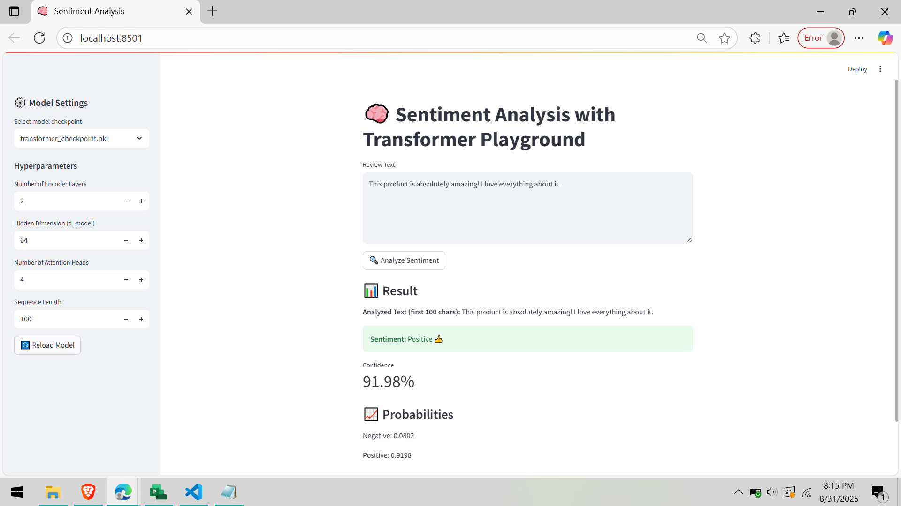

# 🧠 Sentiment Analysis with Transformer

A **Transformer-based Sentiment Analysis App** built with **Streamlit**.  
This project allows you to input review text or scrape product reviews and analyze whether the sentiment is **Positive** or **Negative**.  
It also shows **confidence scores** and **class probabilities**.  

---

## ✨ Features
- ✅ Transformer-based sentiment classifier (trained on IMDB/Amazon reviews)
- ✅ Interactive **Streamlit app**
- ✅ Sidebar controls to tweak **num_heads** and **seq_len**
- ✅ Outputs:
  - Predicted **Sentiment**
  - **Confidence score**
  - **Class probabilities**
- ✅ (Optional) Product review scraping integration
- ✅ Clean UI with real-time analysis

## 📂 Project Structure
|
├── app.py # Streamlit app (UI) 
├── model_utils.py # Model
├── transformer_checkpoint.pkl # Trained model checkpoint
├── requirements.txt # Python dependencies
├── README.md # Documentation (this file)
└── screenshots/ 

---

## 🚀 Setup & Installation

1. Clone the repository:
   git clone https://github.com/Irfan-Alaam/TransformerBasedProductSentimentAnalyzer.git .
   
2. Create a virtual environment and install dependencies:
  python -m venv venv
  source venv/bin/activate   # On Windows: venv\Scripts\activate
  pip install -r requirements.txt

3. Run the Streamlit app
   streamlit run app.py

🛠 Requirements
Dependencies are listed in requirements.txt:
  pip install -r requirements.txt

🖼 Demo
  

🔧 Usage

  1. Enter review text → get instant sentiment prediction
  2. Adjust hyperparameters in sidebar → reload model and see effect on predictions
  3. View confidence and class probabilities

